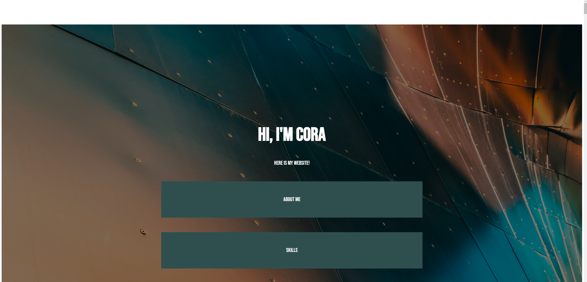

# Week 1
With this week, I found that I did not remember as much as I had hoped. I had to look up a lot of what I did this week, but things did start to come back to me by the time I was onto my style sheet. I had some frustration with my initial layout-- getting the parallaxing to work, the image to fit the screen right, and my page menu to look right was a struggle. Here is an example of a few of the issues i was having:

My menu still looks a little strange on some page sizes. Im also finding that working on my 2k monitor isnt the best move, as most people wont look at the page at this size. 

in adition, it seems that my page cant be deployed. I really hope this isnt a recurring issue. some of the page is up, but the rest is still on my github page, where you can download it. It works totally fine when read off the file.